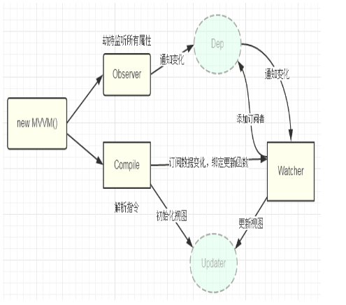

## 理解vuejs
传统的方法：修改某个对象的属性，就选取这个属性对应的html上的dom，如果添加一个对象
或者说是node节点，使用的是append方法
vuejs的思路是不再需要操作dom了，你只要操作数据对象就可以了，对应的html会自动更新
，所以使用vue的时候，基本可以隔离dom操作，代码中的大部分操作对象或者数组

总结：“数据驱动的组件系统”，“dom操作封装在指令中”

## vuejs的双向绑定
访问器属性（es5 的新增，所以不支持ie8）：访问器属性是一种特殊的属性，他不能直接在对象中设置
，而必须通过Object.defineProperty()单独定义：
```javascript
Object.defineProperty(obj,prop,descriptor)
var obj = {}
Object.defineProperty(obj,"key",{
    enumerable: false,
    configurable: false,
    writable: false,
    value: "static",
    set: function(val){
        this.key = val
    },
    get: function(){
        return this.key
    }
})
```
最重要的是set方法：在改变属性的值的时候，需要通过set函数

- view数据改变，以input为例子，添加change事件，值改变的时候设置obj的prop
- obj的prop中的set方法添加一个watcher，值改变触发watcher【发布者】
- 所有有关prop的dom用都是一个对象【订阅者】，包含更改prop值的方法，将所有对象添加到dep【主题对象】
- watcher通过主题对象使所有的观察者更新数据

## vuejs的自定义指令
在vue2.0中，代码的抽象和重用的主要形式是以组件的形式，但是可能在某些情况下，还是需要
对普通元素进行一些底层的dom访问，这是自定义指令仍然使用的场景之处，可以说是“数据驱动视图”的
一种有效补充或者说是扩展，不仅可用于定义任何的dom操作，并且是可以复用的

自定义指令的方法是：Vue.directive("focus",{各种钩子函数})
钩子函数（全部可选）：
bind: 在指令第一次绑定到元素调用，只会调用一次
unbind: 在指令从元素上解除绑定时调用，只会调用一次
inserted: 在已绑定的元素插入到父节点时调用
update:
componentUpdate:

钩子函数的参数：
el: 指令绑定的元素，可以用于直接的dom操作
binding: 一个对象（name,value,oldValue,expression,arg,modifiers）
vnode: 由vue编译器生成的虚拟dom
oldVnode: 之前的虚拟dom

## vue2.0中的虚拟dom
"watcher"是来决定你要不要来更新这个dom，而虚拟DOM是用来找出怎么以最小的代价来更新
这个DOM，其实有了虚拟dom，更大的意义是更好的支持了服务器端渲染；虚拟dom对应的是真实的
dom，使用document.CreateElement和document.CreateTextNode创建的就是真实节点；在更新的时候
通过对比虚拟dom和真实dom来进行必要的dom更新，减少不必要的更新，从而优化性能。其中
虚拟树与真实树的比较涉及到diff算法[参考]{https://github.com/aooy/blog/issues/2}

1. 为什么需要使用虚拟dom？
    - DOM是很慢的，其元素非常大，页面的性能问题很少是因为js引起的，大部分是由dom操作引起的，
    如果对前端进行抽象的话，主要是维护状态和更新视图，而更新视图必须要操作dom；在jquery出现以前
    直接操作dom结构，这种方法复杂度高，兼容性差，jquery强大的选择器以及高度封装的API，解决了兼容性
    问题，同时dom操作也变得简单
    - 接下来，mvvm框架应运而生，使用数据双向绑定，使得我们完全不用操作dom了，更新视图状态会自动更新，
    更新了视图数据状态也会自动更新，可以说大大提升了开发效率，但是大量的事件绑定在复杂场景下的执行性能
    堪忧，有没有一种提高开发效率和执行效率（更新视图）：虚拟dom的诞生
2. 理解虚拟dom？
    - 核心思想：对复杂的文档DOM结构，提供一种方便的工具，进行最小化操作dom：一方面提供方便的工具，使得
    开发效率得到保证；另一方面保证最小的dom操作，使得执行效率得到保证
    - js操作dom：dom很慢，而js很快，用js对象可以很容易地表示dom节点。dom节点包括标签、属性和子节点，通过
    VElement表示：
    ```
    //虚拟dom，参数分别为标签名、属性对象、子DOM列表
    var VElement = function(tagName,props,children){
        //保证只能通过如下方式调用：new VElement
        if(!(this instanceof VElement)){
            return new VElement(tagName,props,children)
        }

        //可以通过只传递tagName和children参数
        if(util.isArray(props)){
            children = props
            props = {}
        }

        //设置虚拟dom的相关属性
        this.tagName = tagName
        this.props = props || {}
        this.children = children || []
        this.key = props ? props.key : void 666
        var count = 0
        util.each(this.children,function(child,i){
            if(child instanceof VElement){
                count += child.count
            }else{
                children[i] = '' + child
            }
            count++
        })
        this.count = count
    }
    ```
    通过VElement，我们可以很简单地用javascript表示dom结构，比如：
    ```
    var dom = velement('div',{'id':'container'},[
        velement('h1',{style: 'color:red'},['item #1'])
    ])
    //表示的dom结构
    <div id="container">
        <h1 style="color:red">item #1</h1>
    </div>
    ```
    同样我们可以很方便地根据虚拟dom树构建出真实的DOM树，具体思路：根据虚拟dom节点的属性和子节点递归构建真实的dom
    树
    ```
    VElement.prototype.render = function(){
        //创建标签
        var el = document.createElement(this.tagName)
        //设置标签属性
        var props = this.props
        for(var propName in props){
            var propValue = props[propName]
            util.setAttr(el,propName,propValue)
        }

        //依次创建子节点的标签
        util.each(this.children,function(child){
            //如果子节点仍然为velement，则递归创建子节点，否则直接创建文本类型节点
            var childEl = (child instanceof VElement) ? child.render() : document.createTextNode(child)
            el.appendChild(childEl)
        })

        return el
    }
    //对一个虚拟的DOM对象VElement，调用其原型的render方法，就可以产生一颗真实的DOM树
    vdom.render()
    //既然我们可以用js对象表示dom结构，那么当数据状态发生变化而需要改变的dom结构时，先通过js对象js对象表示
    的虚拟dom计算出实际dom需要做的最小变动，然后实际dom，从而避免了粗放式的dom操作带来的性能问题
    ```
比较两颗虚拟dom树的差异(old virtual DOM 和 new virtual DOM)使用diff算法对真实dom最小修改

## mvc到mvvm
1. mvc
    - view ui 布局，展示数据
    - Model 管理数据
    - Controller 响应用户操作，并将Model更新到view上

    随着h5的发展，人们更希望使用h5开发的应用能和Native媲美，或者接近与原生App的体验效果，于是前端应用的复杂程度已不同往日，此时前端开发就暴露出了三个痛点：
    开发者在代码中大量调用相同的DOM API，处理繁琐操作冗余，使得代码难以维护；大量的dom操作使得页面渲染性能降低，加载速度减慢，影响用户体验；当Model频繁发生
    变化，开发者需要手动更新到View，当用户的操作导致Model发生变化，开发者同样需要将变化的数据同步到Model中，这样工作很繁杂。
    其实，jquery的出现就是为了前端更加简洁的操作dom，同时封装了对不同浏览器的兼容性写法
2. MVVM
    - model 数据模型
    - view 视图模型
    - viewModel 同步view和model的对象
    在mvvm架构下，view和model之间并没有直接的联系，而是通过viewModel进行交互，model和viewModel之间的交互是双向的，因此view数据变化会同步到model，而model数据的变化
    也会立刻反映到view上；viewModel通过双向数据绑定把view层和model层连接起来，而view和model之间的同步工作是自动完成的，因此开发者关注业务逻辑，不需要动手操作dom，
    不需要关注数据状态的同步问题，复杂的数据状态维护完全有mvvm来统一管理
    
    vue.js是采用object.defineProperty的getter和setter并结合观察者模式来实现数据绑定。把一个普通javascript对象传给Vue实例来作为它的data选项时，vue将遍历它的属性，
    用Object.defineProperty将它们转化为setter\getter，用户看不到getter和setter，但是在内部它们让vue追踪依赖，在属性被访问和修改时通知变化，具体分析如下：
        - observer数据监听器，能够对数据对象的所有属性进行监听，如果有变动就可以拿到最新值并通知订阅者，内部采用object.defineProperty的setter和getter来实现
        - compile指令解析器，它的作用是对每个元素节点的指令进行扫描和解析，根据指令模版替换数据，以及绑定相应的更新函数
        - watcher订阅者，作为连接observer和compile的桥梁，能够订阅并收到每个属性变动的通知，执行指令绑定的相应的回调函数
        - dep消息订阅器（主题对象），内部维护一个数组，用来收集watcher订阅者，数据变动触发notify函数，再遍历订阅者并且触发订阅者的update方法

        从上图可以看出，当执行new Vue()时，vue进入初始化阶段，一方面vue会遍历data选项中的属性，并用object.defineProperty将他们转化为setter\getter,
        实现数据变化监听功能，另一方面，vue的指令编译器compile对元素节点的指令进行扫描和解析；初始化视图，并订阅watcher来更新视图，此时watcher会将自己添加到消
        息订阅器dep中，初始化完毕；
        当数据发生变化时，observer中的setter方法被触发，setter会立即调用dep.notify()，dep开始遍历所有的订阅者，并且调用订阅者的update方法，订阅者收到通知后会进行相应的
        更新

## vue双向绑定的简单实现
需要从三个方面去实现
- 输入框以及文本节点与data中的数据绑定（需要对dom进行编译：DocumentFragment）
- 输入框内容变化时，data中的数据同步变化，即view => model的变化
- data中的数据变化时，文本节点的内容同步变化，即model => view的变化
说明：订阅发布模式：发布者发出通知；主题对象收到通知并推送给订阅者；订阅者执行相应的操作
```html
<div id="app">
    <input type="text" v-model="text">
    {{ text }}
</div>
<script>
    var vm = new Vue({
        el: "app",
        data: {
            text: 'hello world'
        }
    })
</script>
```
```javascript
//数据初始化绑定,挟持dom绑定
function compile(node,vm){
    var reg = /\{\{(.*)\}\}/
    //节点类型为元素
    if(node.nodeType === 1){
        var attr = node.attributes
        //解析属性
        for(var i=0;i<attr.length;i++){
            if(attr[i].nodeName == 'v-model'){
                var name = attr[i].nodeValue  //获取v-model绑定的属性名
                //添加事件view => model
                node.addEventListener('input',function(e){
                    vm[name] = e.target.value
                })
                node.value = vm.data[name] //将data的值赋值给node
                node.removeAttribute('v-model')
            }
        }
    }
    //节点类型为text
    if(node.nodeType === 3){
        if(reg.test(node.nodeValue)){
            var name = RegExp.$1 //获取匹配的字符串
            name = name.trim()
            node.nodeValue = vm.data[name] //将data的值赋值给node
        }
    }
}
function nodeToFragment(node,vm){
    var flag = document.createDocumentFragment()
    var child
    while(child = node.firstChild){
        compile(child,vm)
        flag.appendChild(child) //将节点劫持到文本片段中
    }

    return flag
}

//响应式数据绑定
function defineReactive(obj,key,val){
    var dep = new Dep()
    Object.defineProperty(obj,key,{
        get: function(){
            //添加订阅者watcher到主题对性爱那个dep
            if(Dep.target) dep.addSub(Dep.target)
            return val
        },
        set: function(newVal){
            if(newVal == val) return
            val = newVal
            //作为发布者通知
            dep.notify()
        }
    })
}


function init(obj,vm){
    Object.keys(obj).forEach(function (key){
        defineReactive(vm,key,obj[key])
    })
}

//观察者,在html编译过程中，每个与data关联的节点生成一个watcher
function Watcher(vm,node,name){
    Dep.target = this
    this.name = name
    this.node = node
    this.vm = vm
    this.update()
    Dep.target = null
}
Watcher.prototype = {
    constructor: Watcher,
    update: function(){
        this.get()
        this.node.nodeValue = this.value
    },
    get: function(){
        this.value = this.vm[this.name]
    }
}

//主题对象
function Dep(){
    this.subs = []
}
Dep.prototype = {
    construcotr: Dep,
    addSub: function(sub){
        this,subs.push(sub)
    },
    notify: function(){
        this.subs.forEach(function(sub){
            sub.update()
        })
    }
}


//vue对象
function vue(options){
    this.data = options.data
    var data = this.data

    //初始化数据将数据转化成setter/getter
    init(data,this)

    var id = options.el
    var dom = nodeToFragment(document.getElementById(id),this)
    //编译完成后，将dom返回到app中
    document.getElementById(id).appendChild(dom)
}

var vm = new Vue({
    el: 'app',
    data: {
        text: 'hello world'
    }
})
```


